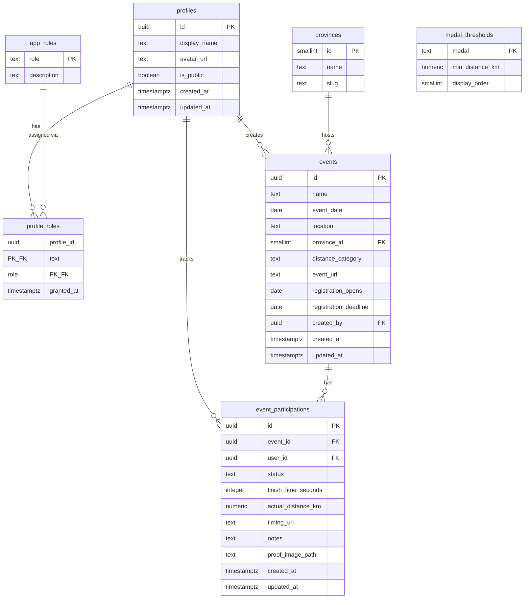

# De Twaalf — Database Schema
**detwaalf.run**

---

## Notes

- `medal_thresholds` is not related to other tables via FK — it is queried by the `get_medal(distance_km)` database function at runtime
- `profile_roles` is a join table with a composite primary key `(profile_id, role)`
- `event_participations` has a unique constraint on `(event_id, user_id)` — one record per user per event
- `finish_time_seconds` is an integer (seconds) — format to `h:mm:ss` in the frontend
- `proof_image_path` is a Supabase Storage path, not a full URL — resolve to a signed URL in the frontend
- `status` enum values: `interested`, `signed_up`, `completed`, `dns`, `dnf`
- `distance_category` enum values: `10k`, `half`, `marathon`
