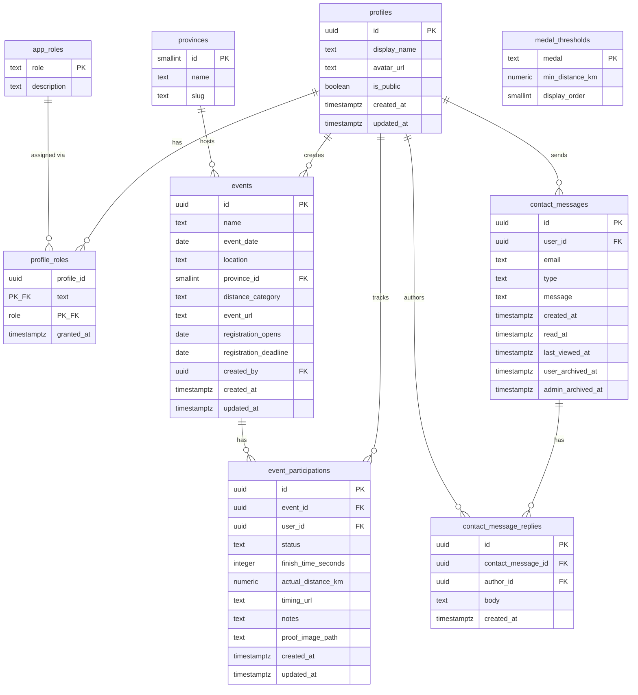

# Twaalf Provincies — Database Schema
**twaalfprovincies.run**

```mermaid
erDiagram
  profiles {
    uuid id PK
    text display_name
    text avatar_url
    boolean is_public
    timestamptz created_at
    timestamptz updated_at
  }
  app_roles {
    text role PK
    text description
  }
  profile_roles {
    uuid profile_id PK_FK
    text role PK_FK
    timestamptz granted_at
  }
  provinces {
    smallint id PK
    text name
    text slug
  }
  medal_thresholds {
    text medal PK
    numeric min_distance_km
    smallint display_order
  }
  events {
    uuid id PK
    text name
    date event_date
    text location
    smallint province_id FK
    text distance_category
    text event_url
    date registration_opens
    date registration_deadline
    uuid created_by FK
    timestamptz created_at
    timestamptz updated_at
  }
  event_participations {
    uuid id PK
    uuid event_id FK
    uuid user_id FK
    text status
    integer finish_time_seconds
    numeric actual_distance_km
    text timing_url
    text notes
    text proof_image_path
    timestamptz created_at
    timestamptz updated_at
  }
  contact_messages {
    uuid id PK
    uuid user_id FK
    text email
    text type
    text message
    timestamptz created_at
    timestamptz read_at
    timestamptz last_viewed_at
    timestamptz user_archived_at
    timestamptz admin_archived_at
  }
  contact_message_replies {
    uuid id PK
    uuid contact_message_id FK
    uuid author_id FK
    text body
    timestamptz created_at
  }

  profiles ||--o{ profile_roles : "has"
  app_roles ||--o{ profile_roles : "assigned via"
  profiles ||--o{ events : "creates"
  profiles ||--o{ event_participations : "tracks"
  provinces ||--o{ events : "hosts"
  events ||--o{ event_participations : "has"
  profiles ||--o{ contact_messages : "sends"
  contact_messages ||--o{ contact_message_replies : "has"
  profiles ||--o{ contact_message_replies : "authors"
```

---

## Notes

- `medal_thresholds` is not related to other tables via FK — it is queried by the `get_medal(distance_km)` database function at runtime
- `profile_roles` is a join table with a composite primary key `(profile_id, role)`
- `event_participations` has a unique constraint on `(event_id, user_id)` — one record per user per event
- `finish_time_seconds` is an integer (seconds) — format to `h:mm:ss` in the frontend
- `proof_image_path` is a Supabase Storage path, not a full URL — resolve to a signed URL in the frontend
- `status` enum values: `interested`, `signed_up`, `completed`, `dns`, `dnf`, `cancelled`
- `distance_category` enum values: `10k`, `half`, `marathon`
- `get_event_cancellation_signals()` returns cancellation counts only for events the authenticated user already has an `interested` or `signed_up` participation for; it does not expose other users' notes
- `contact_messages` stores authenticated user support/contact requests; admins can read and mark them as read, and users can read their own message threads. `last_viewed_at` tracks when the user last opened their message overview so new replies can be highlighted. `user_archived_at` and `admin_archived_at` hide threads from the regular user and admin lists without deleting the underlying record.
- `contact_message_replies` stores in-app admin replies to contact messages. Admins can create replies; the original message owner can read replies to their own messages.
