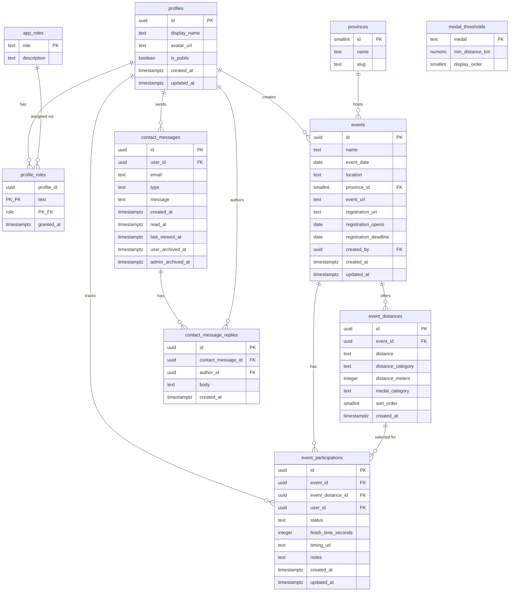

# Twaalf Provincies — Database Schema
**twaalfprovincies.run**

```mermaid
erDiagram
  profiles {
    uuid id PK
    text display_name
    text avatar_url
    boolean is_public
    timestamptz created_at
    timestamptz updated_at
  }
  app_roles {
    text role PK
    text description
  }
  profile_roles {
    uuid profile_id PK_FK
    text role PK_FK
    timestamptz granted_at
  }
  provinces {
    smallint id PK
    text name
    text slug
  }
  medal_thresholds {
    text medal PK
    numeric min_distance_km
    smallint display_order
  }
  events {
    uuid id PK
    text name
    date event_date
    text location
    smallint province_id FK
    text event_url
    text registration_url
    date registration_opens
    date registration_deadline
    uuid created_by FK
    timestamptz created_at
    timestamptz updated_at
  }
  event_distances {
    uuid id PK
    uuid event_id FK
    text distance
    text distance_category
    integer distance_meters
    text medal_category
    smallint sort_order
    timestamptz created_at
  }
  event_participations {
    uuid id PK
    uuid event_id FK
    uuid event_distance_id FK
    uuid user_id FK
    text status
    integer finish_time_seconds
    text timing_url
    text notes
    timestamptz created_at
    timestamptz updated_at
  }
  contact_messages {
    uuid id PK
    uuid user_id FK
    text email
    text type
    text message
    timestamptz created_at
    timestamptz read_at
    timestamptz last_viewed_at
    timestamptz user_archived_at
    timestamptz admin_archived_at
  }
  contact_message_replies {
    uuid id PK
    uuid contact_message_id FK
    uuid author_id FK
    text body
    timestamptz created_at
  }

  profiles ||--o{ profile_roles : "has"
  app_roles ||--o{ profile_roles : "assigned via"
  profiles ||--o{ events : "creates"
  profiles ||--o{ event_participations : "tracks"
  provinces ||--o{ events : "hosts"
  events ||--o{ event_distances : "offers"
  events ||--o{ event_participations : "has"
  event_distances ||--o{ event_participations : "selected for"
  profiles ||--o{ contact_messages : "sends"
  contact_messages ||--o{ contact_message_replies : "has"
  profiles ||--o{ contact_message_replies : "authors"
```

---

## Notes

- Event website, registration and result URLs accept only absolute HTTP/HTTPS links without credentials, whitespace, control characters or backslashes. The `is_safe_http_url` constraints apply to direct Data API writes as well as the event RPCs. Empty optional values remain supported. Existing invalid values must be reviewed before applying the constraints; the migration does not silently delete data.
- Profile reads expose public profiles and the current user's own profile. Participation table reads require authentication and remain subject to ownership/admin policies. Public profile results continue through the narrowly scoped `get_public_profile_participations()` RPC.
- `has_role(text)` uses a fixed empty search path and fully qualified table names. Only authenticated callers may invoke it; direct role-roster reads are revoked. Slug generation and cancellation-signal RPCs also require authentication. These rules are reasserted explicitly because old direct grants survive a revoke from `PUBLIC` alone.
- `private.set_contact_message_email()` is an insert trigger, not a Data API endpoint. It checks that the authenticated user owns the new contact message and derives the sender's current email from `auth.users`, regardless of any client-supplied email. The existing rate-limit and immutable-content trigger still applies. Trusted maintenance inserts must supply an authenticated user context as well.

- `medal_thresholds` / `get_medal(distance_km)` is legacy schema and is not used by the current event-distance flow
- `profile_roles` is a join table with a composite primary key `(profile_id, role)`
- `event_participations` has a unique constraint on `(event_id, user_id)` — one record per user per event
- `event_participations.event_distance_id` stores the specific distance selected for an event participation
- `finish_time_seconds` is an integer (seconds) — format to `h:mm:ss` in the frontend
- `status` enum values: `interested`, `signed_up`, `completed`, `dns`, `dnf`, `cancelled`
- `distance_category` enum values: `10k`, `half`, `marathon`
- `event_distance` enum values: `10k`, `15k`, `10_miles`, `half_marathon`, `30k`, `marathon`
- `event_distances.distance_meters` stores the exact length in meters; the event-write RPCs and `enforce_event_distance_category` trigger derive it from `event_distance`
- `event_distances.distance_category` is retained for existing reads and constrained to match the generated `medal_category`
- `get_event_cancellation_signals()` returns cancellation counts only for events the authenticated user already has an `interested` or `signed_up` participation for; it does not expose other users' notes
- `contact_messages` stores authenticated user support/contact requests; admins can read and mark them as read, and users can read their own message threads. `last_viewed_at` tracks when the user last opened their message overview so new replies can be highlighted. `user_archived_at` and `admin_archived_at` hide threads from the regular user and admin lists without deleting the underlying record.
- `contact_message_replies` stores in-app admin replies to contact messages. Admins can create replies; the original message owner can read replies to their own messages.
